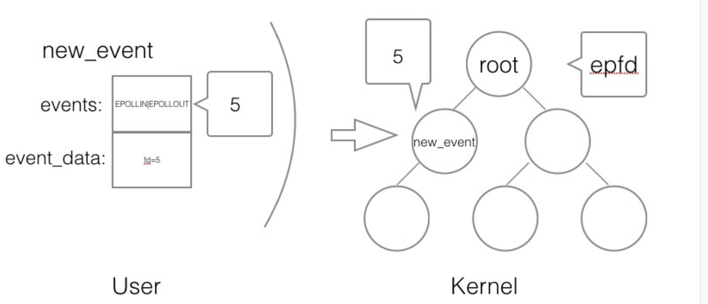
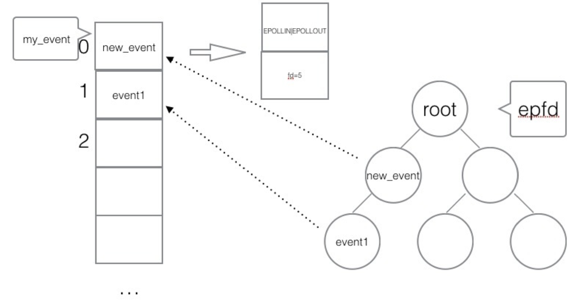
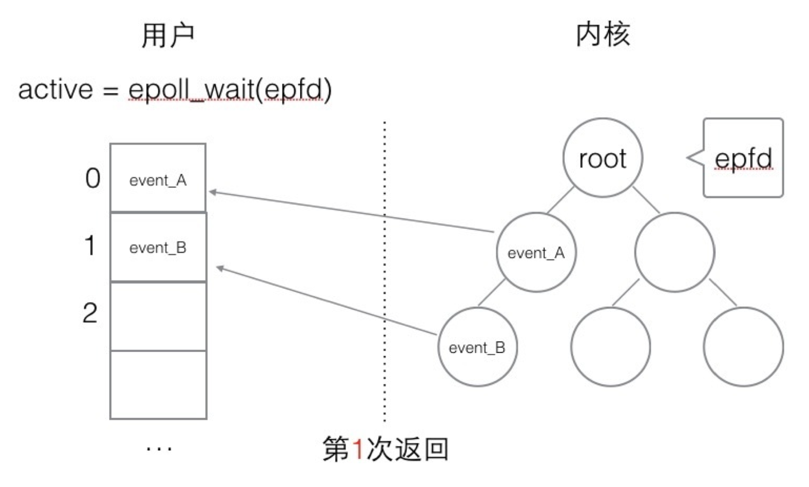
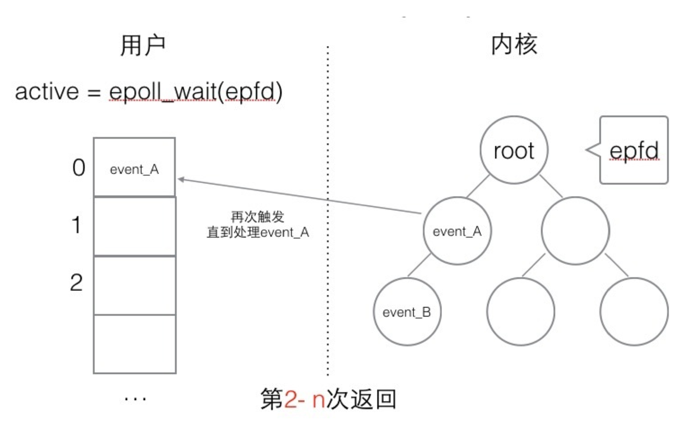
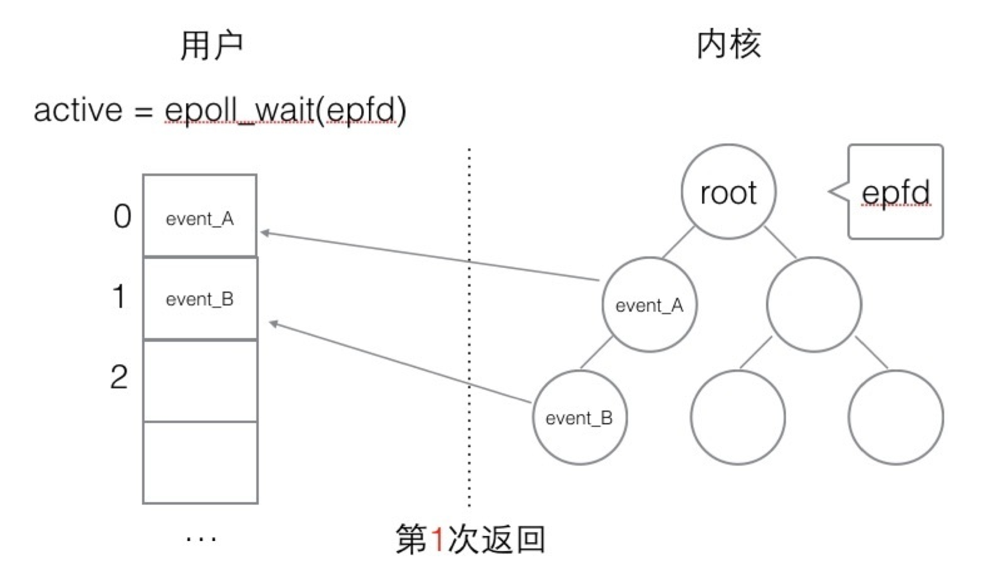
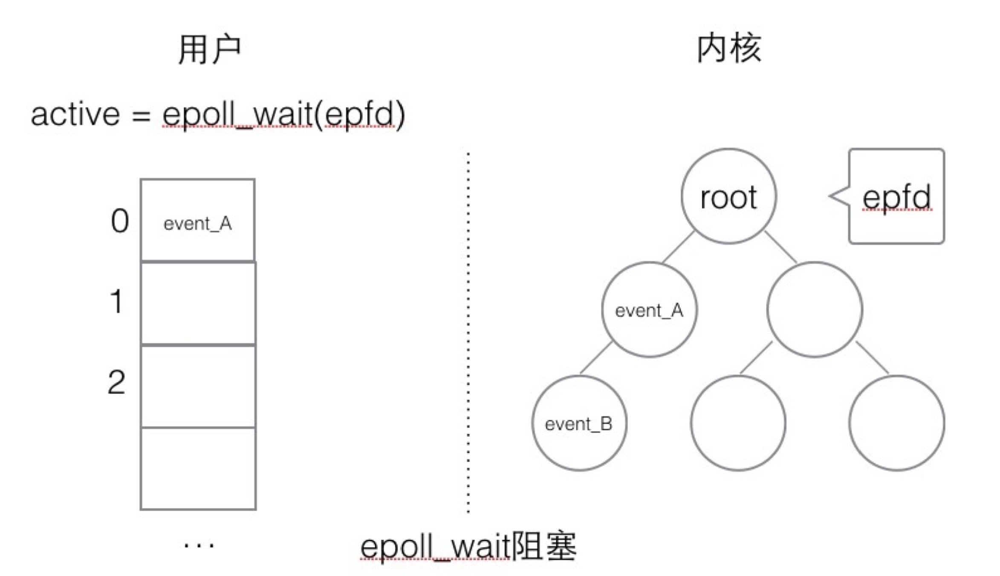
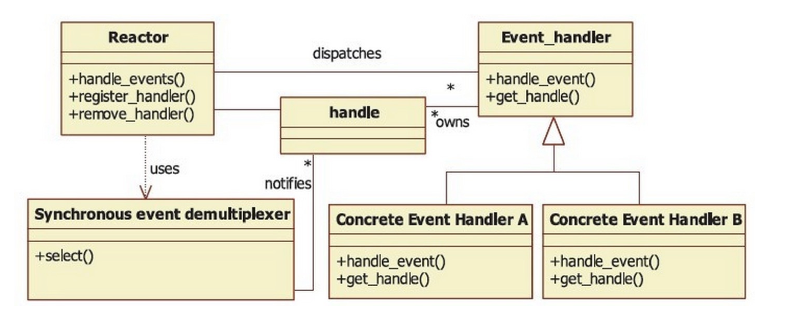
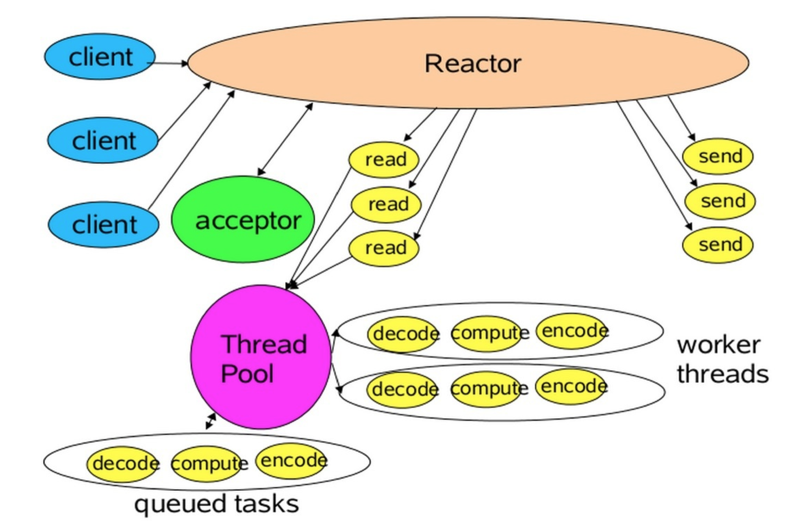

# `LIBEVENT`
## `LIBEVENT`特点
* 事件驱动，高性能
* 轻量级，专注网络
* 跨平台
* 支持多种多路`I/O`复用技术，`epoll,poll,dev/poll,select和kqueue`等
* 支持`I/O`,定时器和信号等

### `EPOLL`基础理论
#### 流
* 可以进行`I/O`操作的内核对象；
* 文件、管道、套接字...
* 流的入口：文件描述符(`fd`)

对流的读写，称为`IO`操作。
#### 阻塞
从一个空的流中读，或向一个满的流写。
#### `epoll`
相关`API`：
1. 创建`epoll`
```cpp
#include <sys/epoll.h>

/**
 * @brief
 * @param  size             内核监听的数目
 * @return int 返回一个epoll句柄(一个文件描述符)
 * */
int epoll_create(int size);

int epfd = epoll_create(1000);

/**
 * @brief
 * @param  epfd             epoll_create创建的句柄fd
 * @param  op		            表示对epoll监控描述符的动作
                              EPOLL_CTL_ADD(注册新的fd到epfd)
                              EPOLL_CTL_MOD(修改已注册到epfd的fd)
                              EPOLL_CTL_DEL(删除一个注册到epfd的fd)
 * @param  fd               需要监听的文件描述符
 * @param  event            内核需要监听的时间
 * @return int              成功返回0，失败返回-1，errno查看具体错误信息
 * */
int epoll_ctl(int epfd, int op, int fd, struct epoll_event *event);

struct epoll_event {
  __uint32_t   events;  // epoll事件
  epoll_data_t data;    // 用户传递的数据
};

/**
 * events: {EPOLLIN,EPOLLOUT,EPOLLPRI,EPOLLHUP
 *          EPOLLLET, EPOLLONESHORT}
 * */

typedef union epoll_data {
  void *   ptr;
  int      fd;
  uint32_t u32;
  uint64_t u64;
} epoll_data_t;

struct epoll_event new_event;

new_event.events  = EPOLLIN | EPOLLOUT;
new_event.data.fd = 5;
epoll_ctl(epfd, EPOLL_CTL_ADD, 5, &new_event);
```

等待`epoll`
```cpp
/**
 * @brief
 * @param  epfd             用epoll_create创建的epoll句柄
 * @param  event            从内核得到的时间集合
 * @param  maxevents        告知内核该event的大小，不超过epoll_create的size
 * @param  timeout          超时时间
 *	                          -1 : 永久阻塞，同步
 *                             0 : 立即返回非阻塞
 *                             >0: 指定微秒数
 * @return int                 成功: 返回有多少文件描述符就绪,时间到时返回0
 *                                   -1 失败，errno查看错误信息
 * */
int epoll_wait(int epfd, struct epoll_event *event, int maxevents, int timeout);

struct epoll_event myevent[1000];
int                event_ctl = epoll_wait(epfd, myevent, 1000, -1);
```

`epoll`编程框架：
```cpp
// 创建epoll
int epfd = epoll_create(1000);

// 将listen_fd添加到epoll中
epoll_ctl(epfd, EPOLL_CTL_ADD, listen_fd, &listen_event);

while (1) {
  // 阻塞等待epoll的fd触发
  int active_cnt = epoll_wait(epfd, events, 1000, -1);
  for (int i = 0; i < active_cnt; i++) {
    if (events[i].data.fd == listen_fd) {
      // accept 并将新的fd加到epoll中
    } else if (events[i].events & EPOLLIN) {
      // 对该fd进行读操作
    } else if (events[i].events & EPOLLOUT) {
      // 对该fd进行写操作
    }
  }
}
```
### 触发模式
#### 水平触发


特点：用户监听`epoll`事件,当内核时间发生时，会拷贝给用户态事件，如果用户只处理一次，剩下的会在下一次`epoll_wait`返回。
#### 边缘触发


边缘触发，只会通知用户一次，下次不再通知。
### `epoll编程例子`
```cpp

/**
 * @ Description  :
 * @ Version      : 1.0
 * @ Author       : koritafei(koritafei@gmail.com)
 * @ Date         : 2021-06-09 17:12:53
 * @ LastEditors  : koritafei(koritafei@gmail.com)
 * @ LastEditTime : 2021-06-12 03:30:37
 * @ FilePath     : /libevent_l/src/epollDemo/epollServer.cpp
 * @ Copyright (C) 2021 koritafei(koritafei@gmail.com). All rights reserved.
 * */

#include <arpa/inet.h>
#include <ctype.h>
#include <netinet/in.h>
#include <stdio.h>
#include <stdlib.h>
#include <string.h>
#include <sys/epoll.h>
#include <sys/socket.h>
#include <sys/types.h>
#include <unistd.h>

#define SERVER_PORT    (7788)
#define EPOLL_MAX_NUM  (2048)
#define BUFFER_MAX_LEN (4096)

char buffer[BUFFER_MAX_LEN];

void to_upper(char *str) {
  int i;
  for (i = 0; i < strlen(str); i++) {
    str[i] = toupper(str[i]);
  }
}

int main(int argv, char **argc) {
  int                listen_fd = 0;
  int                client_fd = 0;
  struct sockaddr_in server_addr;
  struct sockaddr_in client_addr;

  socklen_t          client_len;
  int                epfd = 0;
  struct epoll_event events, *my_event;

  // socket
  listen_fd = socket(AF_INET, SOCK_STREAM, 0);

  // bind

  server_addr.sin_family      = AF_INET;
  server_addr.sin_addr.s_addr = htonl(INADDR_ANY);
  server_addr.sin_port        = htons(SERVER_PORT);
  bind(listen_fd, (struct sockaddr *)&server_addr, sizeof(server_addr));

  // listen
  listen(listen_fd, 10);

  // epoll create
  epfd = epoll_create(EPOLL_MAX_NUM);
  if (epfd < -1) {
    perror("epoll_create error");
    close(epfd);
    close(listen_fd);
    return 0;
  }

  // listenfd-> epfd
  events.events  = EPOLLIN;
  events.data.fd = listen_fd;
  if (0 > epoll_ctl(epfd, EPOLL_CTL_ADD, listen_fd, &events)) {
    perror("epoll_ctl add listen_fd error");
    close(epfd);
    close(listen_fd);
    return 0;
  }

  my_event =
      (struct epoll_event *)malloc(EPOLL_MAX_NUM * sizeof(struct epoll_event));

  while (1) {
    // epoll wait
    int active_fds_cnt = epoll_wait(epfd, my_event, EPOLL_MAX_NUM, -1);
    int i              = 0;
    for (i = 0; i < active_fds_cnt; i++) {
      // if fd == listen_fd
      if (my_event->data.fd == listen_fd) {
        // accept
        client_fd =
            accept(listen_fd, (struct sockaddr *)&client_addr, &client_len);
        if (0 > client_fd) {
          perror("accept error");
          continue;
        }

        char ip[20];
        printf("new connect[%s:%d]\n",
               inet_ntop(AF_INET, &client_addr.sin_addr, ip, sizeof(ip)),
               ntohs(client_addr.sin_port));
        events.events  = EPOLLIN | EPOLLET;
        events.data.fd = client_fd;
        epoll_ctl(epfd, EPOLL_CTL_ADD, client_fd, &events);
      } else if (my_event[i].events & EPOLLIN) {
        printf("epoll in\n");
        client_fd = my_event[i].data.fd;
        // do read
        buffer[0] = '\0';
        int n     = read(client_fd, buffer, 5);
        if (n < 0) {
          perror("read error");
          continue;
        } else if (0 == n) {
          epoll_ctl(epfd, EPOLL_CTL_DEL, client_fd, &events);
          close(client_fd);
        } else {
          printf("read buffer[%s]\n", buffer);
          buffer[n] = '\0';
#if 1
          to_upper(buffer);
          write(client_fd, buffer, strlen(buffer));
          printf("write buffer [%s]\n", buffer);
          memset(buffer, 0, BUFFER_MAX_LEN);
          events.events  = EPOLLOUT;
          events.data.fd = client_fd;
          epoll_ctl(epfd, EPOLL_CTL_MOD, client_fd, &events);
#endif
        }
      } else if (my_event[i].events & EPOLLOUT) {
        printf("epoll out\n");
#if 1
        client_fd = my_event[i].data.fd;
        to_upper(buffer);
        write(client_fd, buffer, sizeof(buffer));
        printf("write buffer[%s]\n", buffer);
        events.events  = EPOLLIN;
        events.data.fd = client_fd;
        epoll_ctl(epfd, EPOLL_CTL_MOD, client_fd, &events);
#endif
      }
    }
  }
}
```
`client`:
```cpp
/**
 * @ Description  :
 * @ Version      : 1.0
 * @ Author       : koritafei(koritafei@gmail.com)
 * @ Date         : 2021-06-11 10:26:28
 * @ LastEditors  : koritafei(koritafei@gmail.com)
 * @ LastEditTime : 2021-06-12 03:29:48
 * @ FilePath     : /libevent_l/src/epollDemo/epollClient.cpp
 * @ Copyright (C) 2021 koritafei(koritafei@gmail.com). All rights reserved.
 * */

#include <arpa/inet.h>
#include <fcntl.h>
#include <netinet/in.h>
#include <stdio.h>
#include <stdlib.h>
#include <string.h>
#include <strings.h>
#include <sys/socket.h>
#include <sys/types.h>
#include <unistd.h>

#define MAX_LINE    (1024)
#define SERVER_PORT (7788)

void setnoblocking(int fd) {
  int opts = 0;
  opts     = fcntl(fd, F_GETFL);
  opts |= O_NONBLOCK;
  fcntl(fd, F_SETFL);
}

int main(int argc, char **argv) {
  int                sockfd;
  char               recvline[MAX_LINE + 1] = {0};
  struct sockaddr_in server_addr;
  if (2 != argc) {
    fprintf(stderr, "usage ./client <server IP>");
    exit(0);
  }

  // 创建socket
  if (0 > (sockfd = socket(AF_INET, SOCK_STREAM, 0))) {
    fprintf(stderr, "socket create error");
    exit(0);
  }

  // server addr 赋值
  bzero(&server_addr, sizeof(struct sockaddr_in));
  server_addr.sin_family = AF_INET;
  server_addr.sin_port   = htons(SERVER_PORT);

  if (0 >= inet_pton(AF_INET, argv[1], &server_addr.sin_addr.s_addr)) {
    fprintf(stderr, "inet_pton error for %s\n", argv[1]);
    exit(0);
  }

  // 链接服务端
  if (0 > connect(sockfd,
                  (struct sockaddr *)&server_addr,
                  sizeof(struct sockaddr_in))) {
    perror("connect");
    fprintf(stderr, "connect error\n");
    exit(0);
  }

  setnoblocking(sockfd);
  char input[100];
  int  n     = 0;
  int  count = 0;

  // 不断地从标准输入读入字符串
  while (NULL != fgets(input, 100, stdin)) {
    printf("send [%s]\n", input);
    n = 0;
    // 输入字符发送到服务端
    n = send(sockfd, input, sizeof(input), 0);
    if (0 > n) {
      perror("send");
    }

    n     = 0;
    count = 0;

    // 读取服务器数据
    while (1) {
      n = read(sockfd, recvline + count, MAX_LINE);
      if (MAX_LINE == n) {
        count += n;
        continue;
      } else if (0 > n) {
        perror("recv error");
        break;
      } else {
        count += n;
        recvline[count] = '\0';
        printf("revc data [%s]\n", recvline);
        break;
      }
    }
  }

  return 0;
}
```
### `reactor`反应堆模式
目标：将一个或多个客户的请求分离(`demultiplex`)和调度(`dispath`)给应用程序。
上下文：在事件应用驱动中，同步、有序的同时处理接收的多个服务请求。
方案：
    在一个或多个事件源上等待事件到来，将事件的分离和调度整合到处理它的服务中，而将分离和调度机制从应用程序对特定事件的处理中分开。
    即：每个应用程序提供的服务都有一个独立的时间处理器与其对应，由事件处理器来自时间源的特定事件。
    每个事件处理器视线注册到`Reactor`管理器中，`Reactor`事件管理器使用同步事件分离器在一个或多个事件源中等待事件发生。当事件发生后，同步事件分离器通知`Reactor`管理器，最后由`Reactor`管理器调度和该事件有关的事件处理器来完成请求服务。

结构：
  > 描述符(`handle`)：`OS`提供，用于识别每个事件。如`socket`描述符，文件描述符等。在`linux`中是一个整数。时间可以来自外部(客户端请求等)，也可以来自内部(定时器时间等)。
  > 同步事件分离器(`demultiplexer`): 一个函数，用来等待一个或多个事件发生。调用者会被阻塞，直到分离器分离的描述符集上有事件发生。`linux`的`select`是常用的分离器。
  >事件处理接口(`event handler`): 一个或多个模板函数组成的接口。这些接口描述了和应用程序相关的对某个事件的接口。
  > 具体的时间处理器：事件处理接口的实现，实现了应用程序提供的服务。每个具体的事件总和一个描述符相关。使用描述符来识别事件、识别应用程序提供的服务。
  > `Reactor`管理器：定义了一些接口，用于应用程序控制事件调度以及应用程序注册、删除事件服务器和相关的描述符。事件处理器调度的核心。
  



`epoll reactor`实现：
```cpp
/**
 * @ Description  :
 * @ Version      : 1.0
 * @ Author       : koritafei(koritafei@gmail.com)
 * @ Date         : 2021-06-13 06:46:41
 * @ LastEditors  : koritafei(koritafei@gmail.com)
 * @ LastEditTime : 2021-06-14 20:10:06
 * @ FilePath     : /libevent_l/src/reactor/reactorServer.cpp
 * @ Copyright (C) 2021 koritafei(koritafei@gmail.com). All rights reserved.
 * */

#include <arpa/inet.h>
#include <asm-generic/errno-base.h>
#include <errno.h>
#include <fcntl.h>
#include <stdio.h>
#include <stdlib.h>
#include <string.h>
#include <sys/epoll.h>
#include <sys/types.h>
#include <time.h>
#include <unistd.h>

#define MAX_EVENTS  1024
#define BUFLEN      128
#define SERVER_PORT 8089

/**
 * @brief
 * status :1--正在监听事件中，0--不存在
 * last_active: 最后一次响应时间，做超时处理
 * */
struct myevent_s {
  int   fd;      // cfd listenfd
  int   events;  // EPOLLIN EPOLLOUT
  void *arg;     // 指向自己的结构体指针
  void (*call_back)(int fd, int events, void *arg);
  int  status;
  char buf[BUFLEN];
  int  len;
  int  last_active;
};

int              g_efd;                     // epoll_create 返回句柄
struct myevent_s g_events[MAX_EVENTS + 1];  // 最后一个events,用于listen fd

void event_set(struct myevent_s *ev,
               int               fd,
               void (*call_back)(int, int, void *),
               void *arg) {
  ev->fd          = fd;
  ev->call_back   = call_back;
  ev->arg         = arg;
  ev->status      = 0;
  ev->last_active = time(NULL);
  ev->events      = 0;

  return;
}

void recvdata(int fd, int events, void *arg);
void senddata(int fd, int events, void *arg);

void event_add(int efd, int events, struct myevent_s *ev) {
  struct epoll_event epv = {0, {0}};
  int                op;
  epv.data.ptr = ev;
  epv.events = ev->events = events;

  if (1 == ev->status) {
    op = EPOLL_CTL_MOD;
  } else {
    op         = EPOLL_CTL_ADD;
    ev->status = 1;
  }

  if (0 > epoll_ctl(efd, op, ev->fd, &epv)) {
    printf("event add failed [fd=%d], events[%d]\n", ev->fd, events);
  } else {
    printf("event add sucessed [fd=%d], events[%d]\n", ev->fd, events);
  }

  return;
}

void event_del(int efd, struct myevent_s *ev) {
  struct epoll_event epv = {0, {0}};
  if (1 != ev->status) {
    return;
  }

  epv.data.ptr = ev;
  ev->status   = 0;

  epoll_ctl(efd, EPOLL_CTL_DEL, ev->fd, &epv);
  return;
}

void acceptconn(int lfd, int events, void *arg) {
  struct sockaddr_in cin;
  socklen_t          len = sizeof(struct sockaddr_in);
  int                cfd, i;

  if (-1 == (cfd = accept(lfd, (struct sockaddr *)&cin, &len))) {
    if (EAGAIN != errno && EINTR != errno) {
      // 暂不做处理
    }
    printf("%s: accept, %s\n", __func__, strerror(errno));
    return;
  }

  do {
    for (int i = 0; i < MAX_EVENTS; i++) {
      if (0 == g_events[i].status) {
        break;
      }
    }

    if (MAX_EVENTS == i) {
      printf("[%s], max connect limit [%d]\n", __func__, MAX_EVENTS);
      break;
    }

    int flag = 0;
    if (0 > (flag = fcntl(cfd, F_SETFL, O_NONBLOCK))) {
      printf("%s, fcntl set nonblock failed, strerror %s\n",
             __func__,
             strerror(errno));
      break;
    }

    event_set(&g_events[i], cfd, recvdata, &g_events[i]);
    event_add(g_efd, EPOLLIN, &g_events[i]);
  } while (0);

  printf("new connect [%s:%d][time:%ld], pos[%d]\n",
         inet_ntoa(cin.sin_addr),
         ntohs(cin.sin_port),
         g_events[i].last_active,
         i);

  return;
}

void recvdata(int fd, int events, void *arg) {
  struct myevent_s *ev = (struct myevent_s *)arg;
  int               len;
  len = recv(fd, ev->buf, sizeof(ev->buf), 0);
  event_del(g_efd, ev);

  if (len > 0) {
    ev->len      = len;
    ev->buf[len] = '\0';
    printf("C[%d]:%s\n", fd, ev->buf);

    // 转换为发送事件
    event_set(ev, fd, senddata, ev);
    event_add(g_efd, EPOLLOUT, ev);
  } else if (0 == len) {
    close(ev->fd);
    // ev - g_events地址相减得到偏移元素的位置
    printf("[fd=%d] pos[%d], closed\n", fd, (int)(ev - g_events));
  } else {
    close(ev->fd);
    printf("recv [fd=%d], error[%d]:%s\n", fd, strerror(errno));
  }

  return;
}

void senddata(int fd, int events, void *arg) {
  struct myevent_s *ev = (struct myevent_s *)arg;
  int               len;
  len = send(fd, ev->buf, ev->len, 0);

  printf("fd=%d\tev=->bud=%s\tev->len=%d\n", fd, ev->buf, ev->len);
  printf("send len = %d\n", len);
  event_del(g_efd, ev);

  if (len > 0) {
    printf("send[fd=%d], [%d]%s", fd, len, ev->buf);
    event_set(ev, fd, recvdata, ev);
    event_add(g_efd, EPOLLIN, ev);
  } else {
    close(ev->fd);
    printf("send [fd=%d], error %s\n", fd, strerror(errno));
  }
  return;
}

void initlistensocket(int efd, short port) {
  int lfd = socket(AF_INET, SOCK_STREAM, 0);
  fcntl(lfd, F_SETFL, O_NONBLOCK);
  event_set(&g_events[MAX_EVENTS], lfd, acceptconn, &g_events[MAX_EVENTS]);
  event_add(efd, EPOLLIN, &g_events[MAX_EVENTS]);

  struct sockaddr_in sin;
  memset(&sin, 0, sizeof(sin));
  sin.sin_family      = AF_INET;
  sin.sin_addr.s_addr = INADDR_ANY;
  sin.sin_port        = htons(port);

  bind(lfd, (struct sockaddr *)&sin, sizeof(sin));
  listen(lfd, 20);

  return;
}

int main(int argc, char **argv) {
  unsigned short port = SERVER_PORT;
  if (2 == argc) {
    port = atoi(argv[1]);
  }

  g_efd = epoll_create(MAX_EVENTS + 1);
  if (0 >= g_efd) {
    printf("create efd n %s err %s \n", __func__, strerror(errno));
  }

  initlistensocket(g_efd, port);

  // 事件循环
  struct epoll_event events[MAX_EVENTS + 1];
  printf("server running:port[%d]\n", port);
  int checkpos = 0, i;
  while (1) {
    // 超时验证，每测试100个链接，不测试listenfd当客户端60s内没有和服务器通信，则关闭此链接
    long now = time(NULL);
    for (int i = 0; i < 100; i++, checkpos++) {
      if (checkpos == MAX_EVENTS) {
        checkpos = 0;
      }
      if (g_events[checkpos].status != 1) {
        continue;
      }

      long duration = now - g_events[checkpos].last_active;
      if (60 <= duration) {
        // 超时关闭
        close(g_events[checkpos].fd);
        printf("event fd [%d] time out\n", g_events[checkpos].fd);
        event_del(g_efd, &g_events[checkpos]);
      }
    }

    // 等待事件
    int nfd = epoll_wait(g_efd, events, MAX_EVENTS + 1, 1000);
    if (0 > nfd) {
      printf("epoll_wait error, exits\n");
      break;
    }

    for (i = 0; i < nfd; i++) {
      struct myevent_s *ev = (struct myevent_s *)events[i].data.ptr;
      if ((events[i].events & EPOLLIN) && (ev->events & EPOLLIN)) {
        ev->call_back(ev->fd, events[i].events, ev->arg);
      }

      if ((events[i].events & EPOLLOUT) && (ev->events & EPOLLOUT)) {
        ev->call_back(ev->fd, events[i].events, ev->arg);
      }
    }
  }

  return 0;
}
```
### `event_base`
1. 创建默认的`event_base`:
`event_base_new()`创建并返回一个新的具有默认设置的`event_base`。
函数会检测环境变量，返回一个`event_base`指针,发生错误则返回`NULL`。
`struct event_base event_base_new(void)`。
2. 创建复杂的`event_base`
对取得的`event_base`有更多的控制，需要使用`event_config`。
```cpp
struct event_config *event_config_new(void);
struct event_base *event_base_new_with_config(const struct event_config *cfg);

void event_config_free(struct event_config *cfg);
```
首选创建`event_config`，调用`event_base_new_with_config`设置相关的`event_base`属性。最后调用`event_config_free()`释放`event_config`。
```cpp
int event_config_avoid_method(struct event_config *cfg, const char *method);

enum event_method_feature {
  EV_FEATURE_ET = 0x01,  //要求支持边沿触发后端
  EV_FEATURE_O1 =
      0x02,  // 添加、删除单个事件,或者确定哪个事件激活的时间是O(1)的后端
  EV_FEATURE_FDS = 0x04,  // 支持任意文件描述符，不仅仅是套接字后端
};

int event_config_require_features(struct event_config*      cfg,
                                  enum event_method_feature feature);

enum event_base_config_flag {
  EVENT_BASE_FLAG_NOLOCK = 0x01,  // 不为event_base分配锁，不再线程安全
  EVENT_BASE_FLAG_IFNORE_ENV =
      0x02,  // 选择使用的后端时，不要检测EVENT*环境变量.难以分清code与libevent的交互
  EVENT_BASE_FLAG_STARTUP_IOCP =
      0x04,  // 仅windows使用，在libevent启动时，启用必需的IOCP分发逻辑
  EVENT_BASE_FLAG_NO_CACHE_TIME =
      0x08,  // 不在事件循环每次准备调用超时回调时检测当前时间，而是每次超时回调后检测。
  EVENT_BASE_FLAG_EPOLL_USE_CHANGELIST =
      0x10,  // 使用epoll-changelist,其可以在后端分发函数之间调用，避免内核拷贝。
  EVENT_BASE_FLAG_PRECISE_TIMER = 0x20,
};

int event_config_set_flag(struct event_config*        cfg,
                          enum event_base_config_flag flag);
```
调用`event_config_avoid_method()`可以让`libevent`避免使用特定的后端。
调用`event_config_require_feature()`可以让`libevent`不使用不能提供所有指定特征的后端。
### 检查`event_base`后端
```cpp
/**
 * @brief 检查event_base支持的特征
 * @return const char** 指向libevent支持的方法名字数组
 * */
const char **event_get_supported_methods(void);

int          i;
const char **method = event_get_supported_methods();
printf("Starting libevent %s. Available methods are \n", event_get_version());

for (i = 0; method[i] != NULL; i++) {
  printf(" %s\n", method[i]);
}
```
接口2
```cpp
/**
 * @brief event_base正在使用的方法
 * @param  base
 * @return const char*
 * */
const char* event_base_get_method(const struct event_base* base);

/**
 * @brief event_base支持的特征的比特掩码
 * @param  base
 * @return enum event_method_feature
 * */
enum event_method_feature event_base_get_feature(const struct event_base* base);
```
使用实例：
```cpp
#include <event.h>
#include <event2/event.h>
#include <stdio.h>
#include <stdlib.h>

int main(int argc, char **argv) {
  struct event_base *base;
  // enum event_method_feature f;
  int f;

  base = event_base_new();
  if (!base) {
    printf("Couldn't get an event_base!\n");
  } else {
    printf("Using Libevent with backend method %s.\n",
           event_base_get_method(base));
    f = event_base_get_features(base);
    if (f & EV_FEATURE_ET) {
      printf(" Edge-triggered events are supported\n");
    }
    if (f & EV_FEATURE_O1) {
      printf(" O(1) event notification is supported\n");
    }

    if (f & EV_FEATURE_FDS) {
      printf(" All FD types are supported\n");
    }
  }
}
```
`event_base`释放
```cpp
/**
 * @brief event_base 释放
 * @param  base            
 * */
void event_base_free(struct event_base *base);
```
`event_base`优先级
`event_base`支持优先级设置。
```cpp
/**
 * @brief 优先级设置
 * @param  base             
 * @param  n_priority       
 * @return int 
 * */
int event_base_priority_init(struct event_base * base, int n_priority);
```
> 最好在任何事件激活之前调用该函数，最佳时间：创建`event_base`之后调用。

### 事件循环`event_loop`
一旦有一些已经注册了某些事件的`event_base`，就需要让`libevent`等待并通知时间的发生。

```cpp
#define EVLOOP_ONCE                                                            \
  0x01  // 循环等待某些事件成为激活的,执行激活的事件，直到没有更多的事件可执行则返回
#define EVLOOP_NONBLOCK         0x02  //循环不会等待事件触发，只要事件就绪立刻触发
#define EVLOOP_NO_EXIT_ON_EMPTY 0x04

/**
 * @brief  运行直到注册的event_base中没有已经注册的事件为止
 *					函数重复检查是否有已注册事件发生，如果有事件发生，则将该事件标记为激活的
 * @param  base
 * @param  flags
 * @return int
 * */
int event_base_loop(struct event_base *base, int flags);
```
`event_base_loop`算法概要：
```cpp
while(any events are registered with loop or EVLOOP_NO_EXIT_ON_EMPTY set) {
  if(EVLOOP_NONBLOCK was set, or any events are already active){
    If any registered events have triggered, mark them active
  }else {
    wait until at least one event has triggered, and mark it active
  }

  for(p = 0; p < n_priorities;++p){
    if (any event with priority of p is active){
      Run all active events with priority of p
      break
    }
  }

  if(EVLOOP_ONCE was set or EVLOOP_NONBLOCK was set){
    break
  }
}
```
```cpp
/**
 * @brief 一直运行直到没有已经注册的事件,
 * 或调用了event_base_loopbreak()或event_base_loopexit()为止
 * @param  base
 * @return int
 * */
int event_base_dispatch(struct event_base *base);
```
#### 停止循环
```cpp
/**
 * @brief 给定时间停止循环，如果timeval为NULL，立刻停止循环
 * @param  base
 * @param  t
 * @return int
 * */
int event_base_loopexit(struct event_base *base, const struct timeval *t);

/**
 * @brief 立刻停止循环
 * @param  base
 * @return int
 * */
int event_base_loopbreak(struct event_base *base);
```
如果正在执行循环，在等待激活时间运行结束，结束循环。
```cpp
/**
 * @Copyright (c) 2021  koritafei
 * @file eventLoopDemo.cc
 * @brief
 * @author koritafei (koritafei@gmail.com)
 * @version 0.1
 * @date 2021-06-20 08:06:83
 *
 * */

#include <event2/event.h>
#include <event2/util.h>

#include <iostream>

void cb(int sock, short what, void *arg) {
  struct event_base *base = (struct event_base *)arg;
  event_base_loopbreak(base);
}

void main_loop(struct event_base *base, evutil_socket_t watchdag_fd) {
  struct event *watchdag_event;
  watchdag_event = event_new(base, watchdag_fd, EV_READ, cb, base);

  event_add(watchdag_event, NULL);
  event_base_dispatch(base);
}

void run_base_with_ticks(struct event_base *base) {
  struct timeval ten_sec;
  ten_sec.tv_sec  = 10;
  ten_sec.tv_usec = 0;

  while (1) {
    event_base_loopexit(base, &ten_sec);
    event_base_dispatch(base);

    puts("Ticks");
  }
}

int main(int argc, char **argv) {
  struct event_base *base = event_base_new();
  run_base_with_ticks(base);
}
```
判断是否正常结束，使用以下函数：
```cpp
int event_base_got_break(struct event_base *base);
int event_base_got_exit(struct event_base *base);
```
#### 转储`event_base`状态
```cpp
/**
 * @brief 将event_base的事件和状态完整列表输出到文件中
 * @param  base
 * @param  fp
 * */
void event_base_dump_events(struct event_base *base, FILE *fp);
```


