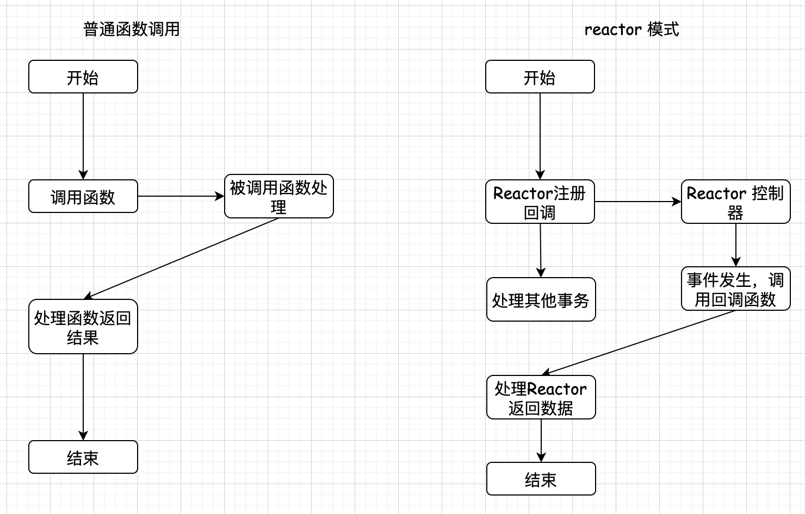
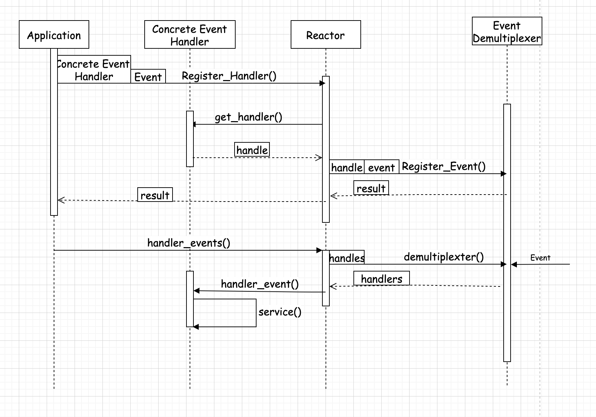
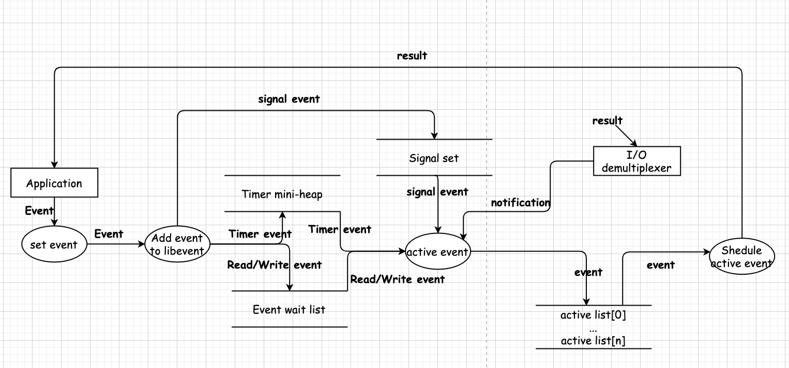

# `libevent`分析
## `Reactor`模式

`Reactor`模式的优点：
> 1. 响应快，不被单个同步事件阻塞
> 2. 编程简单，避免多线程/进程切换开销，避免复杂的多线程及同步问题
> 3. 可扩展性，通过扩展`Reactor`来充分利用`CPU`资源
> 4. 可复用性，框架与具体事件处理逻辑无关

`Reactor UML`:

1. 事件源
程序在指定句柄上注册关系的事件；
2. `event demultiplexter---`事件多路分发机制
操作系统提供的多路`I/O`复用机制。
3. `Reactor--`反应器
事件管理的接口。负责注册，注销和调用回调函数。
常用声明方式：
```cpp
class Reactor{
public:
  int register_handle(Event_handler *pHandler, int event);
  int remove_handle(Event_handler *pHandler, int event);
  void handler_event(timeval *ptv);
};
```
4. `Event Handlers--`事件处理器
事件处理接口。
常用声明方式：
```cpp
class Event_Handler{
public:
  virtual void handle_read() = 0;
  virtual void handle_write() = 0;
  virtual void handle_timeout() = 0;
  virtual void handle_close() = 0;
  virtual HANDLE get_handle() = 0;
};

class Event_Handler{
public:
  virtual void handle_events(int events) = 0;
  virtual HANDLE get_handle() = 0;
};
```


## 基本使用场景和事件流程

## `libevent`源码组织
1. 头文件
   主要是`event.h`: 事件宏定义，接口函数声明，主要结构体`event`声明；
2. 内部头文件
   `xxx-internal.h`: 内部数据结构函数，对外不可见；
3. `libevent`框架
   `event.c`: `event`整体框架的实现；
4. 对系统多路`I/O`封装
   `epoll.c`: 对`epoll`的封装；
   `select.c`: 对`select`的封装；
   `devpoll.c`: 对`dev/poll`的封装；
   `kqueue.c`: 对`kqueue`的封装。
5. 定时事件管理
   `min-heap.c`: 以时间为`key`的小根堆
6. 信号管理
   `signal.c`: 对信号事件的处理
7. 辅助功能函数
   `evutil.h`和`evutil.c`: 辅助功能函数，包括创建一些`socker pair`和一些事件操作比较函数: 加，减和比较等;
8. 日志
   `log.h`和`log.c`: 日志函数;
9. 缓冲区管理
    `evbuffer.c`和`buffer.c`: `libevent`对缓冲区的封装
10. 基本数据结构
    `compat/sys`下的两个源文件：`queue.h`是`libevent`的基本数据结构实现，包括链表，双向链表等;`_libevent_time.h`: 时间操作的结构体定义，函数和定义。
11. 实用网络库
    `http和evdns`: 基于`libevent`实现的`http`和异步`dns`查询库。


